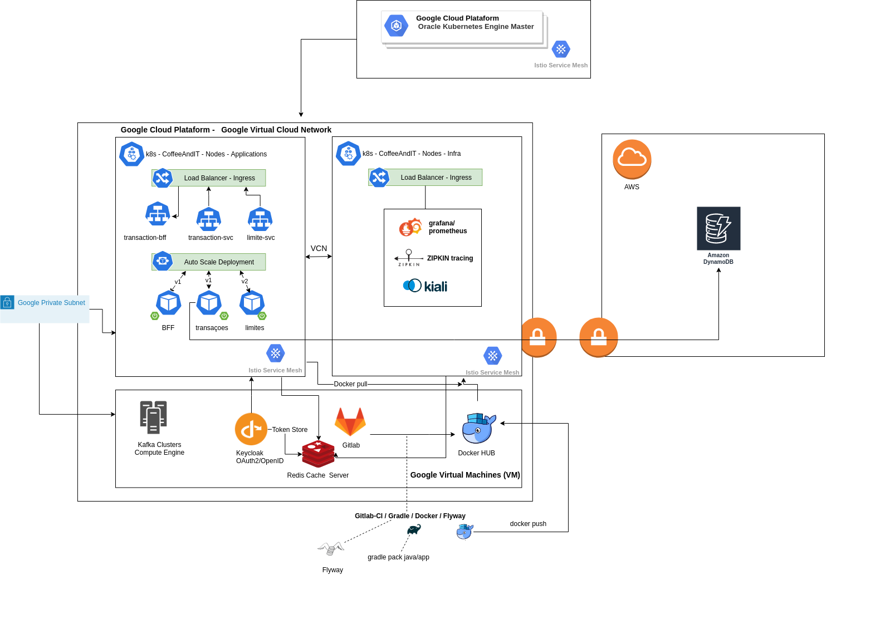

## Serviço persistência de transações para posterior liquidação por produto de domínio específico, valida as transações e persiste no DynamoDB e manda notificações 
## no caso de suspeita de fraudes.
 

